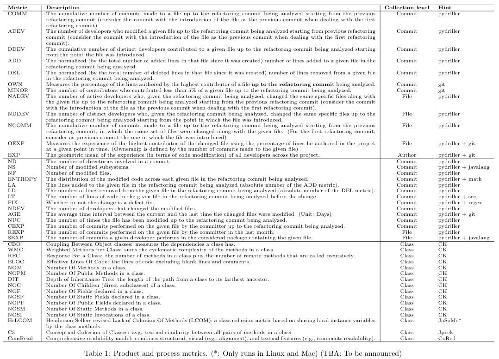

# SoftwareDevelopment-ProjectA

Course project of subject Software Development, Maintenance and Operation - Option A

## Introduction

This project is about investigating the motivations behind using refactoring and the effects it has on software quality. We first mine refactoring data from the selected repositories using tools like RefactoringMiner and PyDriller, which analyse commit histories to detect refactoring commits and its related changes. The results reveal patterns in developer behavior and provide insights into how various metrics influence refactoring decisions. Finally, we give our feedback into the understanding of refactoring by software developers, and can provide evidence-based metrics to support developers motivations in choosing a practice that improves the code maintainability.

## Code Usage

This project is divided into 2 parts. In part 1, we will do refactoring mining and get commit diffs/messages. In part 2, we will calculate software metrics.

### Part 1

In order for you to easily understand part 1, we implement step by step in [ProjectA_Part1.ipynb](ProjectA_Part1.ipynb)

But for streamline running refactoring miner, collecting commit messages and commit diffs, we use 2 files [csc-refactdrill.py](csc-refactdrill.py) and [filter_refactoring_commits.py](filter_refactoring_commits.py). Also, [job.sh](job.sh) is used for running [CSC Puhti](https://www.puhti.csc.fi/public/) - a super computer at CSC.

### Part 2

Here are metrics we will calculate:

The code used to calculate metrics from COMM to OWN is in folder [metrics-COMM-OWN](./metrics-COMM-OWN)

The code used to calculate metrics from MINOR to EXP is in this file [calc_1b_metrics.py](./metrics-MINOR-SEXP/calc_1b_metrics.py)

The code used to calculate metrics from ND to SEXP is in this file [calc_2_metrics.py](./metrics-MINOR-SEXP/calc_2_metrics.py)

The code used to calculate metrics from CBO to NOSI is in folder [metrics-CBO-NOSI](./metrics-CBO-NOSI)

## Results

Here are the links to our results:

- Refactorings and Commit diffs/messages: https://unioulu-my.sharepoint.com/:f:/g/personal/htrinh23_student_oulu_fi/EuDQhQadFeFCkt2DZdf-EuoBUxNq3mzA7tdh1lOFFgFmWA?e=3gVJpV

- Result metrics (1a) from COMM to OWN: https://unioulu-my.sharepoint.com/:u:/g/personal/htrinh23_student_oulu_fi/EX7TJtAVZpdMmDm0zAb0JO4BKv4JvS4QkzJLlKdBAaZKow?e=RxbSjn

- Result metrics (1b) from MINOR to EXP: https://unioulu-my.sharepoint.com/:u:/g/personal/htrinh23_student_oulu_fi/Ec1HkAgYd-1JjjPX1e5aetUBb4_TcLkkvxkWsL_qP0W9dg?e=4NNIp7

- Result metrics (2) from ND to SEXP: https://unioulu-my.sharepoint.com/:u:/g/personal/htrinh23_student_oulu_fi/ES8yDdfZ0udJhHPri4y27cABKpCGGMDIOx5lJzXjvojkdg?e=fVD0k2

- Result metrics (3) from CBO to NOSI: https://unioulu-my.sharepoint.com/:u:/g/personal/htrinh23_student_oulu_fi/EZv0N4SfocZGm1LCk6XxOjgBxb2WBphjP5PmhhhWLindsw?e=xhCWbn

### Report

You can find more details in our report at [SD_Maintenance_Operation_Final_Project.pdf](SD_Maintenance_Operation_Final_Project.pdf)

**_ Note _**

If you have any questions related to the project, please contact us via emails:

- Hung Trinh - Hung.TRINH@student.oulu.fi
- Mazen Hassaan - Mazen.Hassaan@student.oulu.fi
- Nicolas Gorgette - nicolas.gorgette@epfedu.fr
- Juuso Anttila - Juuso.Anttila@student.oulu.fi
